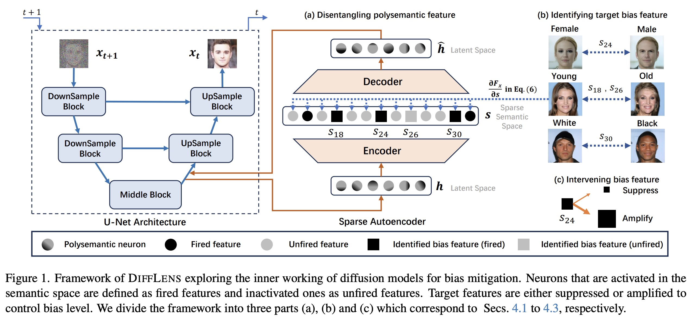

<h2 align="center">
  <b>DiffLens: Dissecting and Mitigating Diffusion Bias via Mechanistic Interpretability</b>

<div align="center">
    <a href="https://arxiv.org/abs/2503.20483" target="_blank">
    </a>
    <a href="https://foundation-model-research.github.io/difflens" target="_blank">
    </a>
</div>
</h2>

This is the official repository of [**DiffLens: Dissecting and Mitigating Diffusion Bias via Mechanistic Interpretability (CVPR2025)**](https://arxiv.org/abs/2503.20483)

## Update
[2025.06.13] Release code.

## Pipeline

TL;DR: A method to dissect and mitigate social bias in diffusion models by identifying and intervening in key bias-generating features within neuron activities.


## Installation

Please follow the steps below to perform the installation：

### 1. Create virtual environment
```bash
conda create -n difflens python=3.9
conda activate difflens
```

### 2. Install packages
```bash
pip install -r requirements.txt
```

## Download models and datasets

### 1. P2 model.
Download the CelebA-HQ checkpoint from [**P2 weighting (CVPR 2022)**](https://drive.google.com/drive/folders/1bcWh3XuQzdct4-UPTrIX-lvs47OiLaOM?usp=sharing), and then put the checkpoint into a folder `pretrained_model/P2`.

### 2. Stable Diffusion v1.5
Download the model from [**Stable Diffusion v1.5**](https://huggingface.co/stable-diffusion-v1-5/stable-diffusion-v1-5).

### 3. Download Fairface checkpoint to evaluate FD metric.
Download the `res34_fair_align_multi_7_20190809.pt` checkpoint from [**FairFace (WACV 2021)**](https://drive.google.com/drive/folders/1F_pXfbzWvG-bhCpNsRj6F_xsdjpesiFu), and then put the checkpoint into a folder `evaluation/Fairface`.

If you want to evaluate the images generated by Stable Diffusion v1.5, you need download **dlib** checkpoints from [**FairFace (WACV 2021)**](https://github.com/dchen236/FairFace).

## Prepare latent dataset for P2 model
*You can ***skip*** this step and proceed directly to the **"Bias Mitigation"** step because we have provided ready-to-use resources.*

### 
```bash
cd ./utils/P2

# for training h-classifier
python prepare_h_classifier_latents.py

# for locating features
python prepare_locating_latents.py
```

## Dissecting Bias Mechanism
> [!TIP]
> *For P2, You can ***skip*** this step and proceed directly to the **"Bias Mitigation"** step, because we have provided ready-to-use resources* in [Checkpints (Google Drive)](https://drive.google.com/drive/folders/1VxfXj4RO-tnxzTQ3LiuBmTGXAtEnkRtm?usp=drive_link).
> *For Stable Diffsion v1.5, you can ***skip*** both **"Train SAE"** and **"Train h-classifier"** steps.*

### 1. Train SAE
```bash
# You can also use torchrun to start pytorch DDP
# Set train_sae.train to True in ./config/P2/example_P2.yaml.
python -m difflens ./config/P2/example_P2.yaml
```
Then the SAE checkpoint will be saved into `sae-ckpts`.

### 2. Train h-classifier
```bash
# set train_h_classifier.train to True in ./config/P2/example_P2.yaml.
python -m difflens ./config/P2/train_h_classifier/h_classifier_config.yaml
```

### 3. Locate features
```bash
# set locate.locate to True in ./config/P2/example_P2.yaml.
python -m difflens ./config/P2/example_P2.yaml
```

After locating features, you need aggregate features across diffusion timesteps.
```bash
cd ./utils/P2

python aggregate_features.py
```

# Bias Mitigation
*We provide an example of P2 model.*
*You can download SAE checkpoint and features from [Checkpints (Google Drive)](https://drive.google.com/drive/folders/1VxfXj4RO-tnxzTQ3LiuBmTGXAtEnkRtm?usp=drive_link)*

### 1. Generate
You can generate images using following commands.

```bash
# Set bias_mitigation.generate to True in ./config/P2/example_P2.yaml.
python -m difflens ./config/P2/example_P2.yaml
```

Some parameters in `./config/P2/bias_mitigation/generate_config_age.yaml`

- `target_attr`: age (Choose one from `age`, `gender` and `race`)
- `top_k_list`: 30_30_30 (e.g. `gender` has two classes, `male` and `female`, and the `top_k_list` should be `30_30`)
- `edit_ratios`: 1.0_1.0_3.0 (e.g. `gender` has two classes, `male` and `female`, and the `edit_ratios` should be `1.0_1.0`)
- `edit_method`: multiply_all_probability (Choose one from `multiply_all`, `multiply_all_probability`, `add_all_probability` and `add_all_probability`. `multiply_all` means `Scaling` features regardless pos in images. `add_all` means `Adding` features regardless pos in images.)

### 2. Evaluate
- Fairness Discrepancy:
For FD metric, you can use Fairface to test your images. Here is an example of `age`.

If you want to evaluate images generated by Stable Diffusion v1.5, you need to crop face using `./evaluation/crop_face/crop.py` first.

```bash
cd ./evaluation/Fairface

python age.py
```

Edit `file_lists` if you want to change the path of images.

- CLIP-I:
We provide a script `clip_image_score.py` for CLIP-I.

```bash
cd ./evaluation/CLIP

python clip_image_score.py
```

- FID:
We use `clean-fid` to calculate FID.

```bash
cd ./evaluation/FID

python fid.py
```

## Citation

```
@InProceedings{Shi_2025_CVPR,
    author    = {Shi, Yingdong and Li, Changming and Wang, Yifan and Zhao, Yongxiang and Pang, Anqi and Yang, Sibei and Yu, Jingyi and Ren, Kan},
    title     = {Dissecting and Mitigating Diffusion Bias via Mechanistic Interpretability},
    booktitle = {Proceedings of the Computer Vision and Pattern Recognition Conference (CVPR)},
    month     = {June},
    year      = {2025},
    pages     = {8192-8202}
}
```